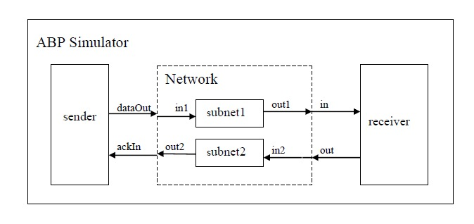

# ALTERNATE BIT PROTOCOL

### Table of contents

- [Introduction](#Introduction)
- [File Organization](#File-Organization)
- [Instructions](#Instructions)
	- [Installing dependencies](#Installing-dependencies)
	- [Run the simulator](#Run-the-simulator)
	- [Run the unit tests](#Run-the-unit-tests)
- [Contributions](#Contributions)

## Introduction 

Alternate Bit Protocol (ABP) simulator is a communication protocol to ensure reliable transmission through an unreliable network. It consists of three components: sender, network (decomposed further into two subnets) and receiver. The sender sends a packet and waits for an acknowledgement. If the acknowledgement doesn't arrive within a predefined time, the sender re-sends this packet until it receives an expected acknowledgement and then sends the next packet. In order to distinguish two consecutive packets, the sender adds an additional bit on each packet (called alternating bit because the sender uses 0 and 1 alternatively). 

The behavior of receiver is to receive the data and send back an acknowledgement extracted from the received data after a time period. The subnets just pass the packets after a time delay. However, in order to simulate the unreliability of the network, only 95% of the packets will be passed in each of the subnet, i.e. 5% of the data will be lost through the subnet.

This ABP simulator is implemented in Cadmium. The behaviour and specification of the simulator is explained in detail in the alternatebitprot.pdf found in [documentation](https://github.com/Revanth91/AlternateBitProtocolSimulator/tree/master/doc) section. In this project, we focus on reviewing the code and following the standard coding conventions, modifying documentation as per proposed coding standard and improving the performance of the simulator.

**Structure of Alternate Bit Simulator**

## File Organization

### data [This folder contains the input and output files for the simulator]
1. input [This folder contains the input files]
	- abp_input_0.txt
2. output [This folder contains the output files]
	- abp_output.txt
	- abp_processed_output.csv

### doc [This folder contains the documentation]
1. alternate_bit_protocol.pdf
2. documentation__cadmium_ubuntu.pdf
3. documentation_cadmium_windows.pdf

### include [This folder contains the various header files used in the project]
1. atomics [This folder contains the atomics header files ]
	- receiver_cadmium.hpp
	- sender_cadmium.hpp
	- subnet_cadmium.hpp
2. data_structures [This folder contains the data structures header files]
 	- message.hpp
3. transform.hpp	
4. user_output_query.hpp

### lib [This folder contains the third party library files]
1. cadmium [This folder contains the cadmium library files]
2. DESTimes [This folder contains the DESTimes library files]
3. iestream.hpp

### src [This folder contains the source files used for the simualator] 
1. data_structures [This folder contains the source files from data_structures]
	- message.cpp
2. top_model [This folder contains the source files for top_model]
	- main.cpp
3. tranform.cpp
4. user_output_query.cpp

### test [This folder contains files realted to the unit tests]
1. data [This folder contains the input and output files for the unit tests]
	1. sender [This folder contains data for sender testing and simulator outputs]
		- sender_test_input_ack.txt
		- sender_test_input_control.txt
		- sender_test_output.txt
		- sender_test__processed_output.csv
	2. subnet [This folder contains data for subnet testing and simulator outputs]
	    - subnet_test_input.txt
	    - subnet_test_output.txt
	    - subnet_test__processed_output.csv
	3. receiver [This folder contains data for receiver testing and simulator outputs]
	    - receiver_test_input.txt
	    - receiver_test_output.txt
	    - receiver_test__processed_output.csv

2. src [This folder contains the source code files for the unit tests]
	1. sender [This folder contains source code for the sender component]
		- main.cpp
	2. subnet [This folder contains source code for the subnet component]
		- main.cpp
	3. receiver [This folder contains source code for the receiver component]
		- main.cpp

## Instructions

### Installing dependencies

Below are the instructions to install dependencies on **Windows operating system** and the same is available in the [documentation](https://github.com/Revanth91/AlternateBitProtocolSimulator/tree/master/doc) section.

1. apt-cyg installations: Open Cygwin in administrator mode and type the below commands, 
	1. `wget rawgit.com/transcode-open/apt-cyg/master/apt-cyg`
	2. `install apt-cyg/bin`
	3. `apt-cyg install git` Please use this command if you don't have git pre-installed in your system.

2. Cadmium dependencies installations: 
	1. Open the Cygwin terminal in the location where you have downloaded the setup (.exe) file for cygwin. 
	2. Type `./setup-x86_64.exe -q -P libboost-devel` or `apt-cyg install libboost-devel`. This will install boost library.

3. Cloning the project
	1. Open the Cygwin terminal and type `git clone --recursive <project URL>` to clone/download the project and move your Cygwin terminal to the ABP project location. 
	2. Make a pull request to the repository that contains the submodule's using `git pull origin [repository name]`
	2. As a new user when you clone/download the repository, you will find that the cadmium and DESTimes folders are empty because they have been used as sub modules in the project.
	3.  Git expects users to explicitly download the contents of the submodule. hence use `git submodule update --init` to download the submodules into the local repository. 
 
Alternatively, if you want to clone/download the cadmium and DESTimes in a different location, you may follow the instructions available in the [documentation](https://github.com/Revanth91/AlternateBitProtocolSimulator/tree/master/doc) section. .

For **Linux operating system**, there is a seperate set of instructions available in the [documentation](https://github.com/Revanth91/AlternateBitProtocolSimulator/tree/master/doc) section.

### Run the simulator
1. Open the terminal. Press in your keyboard `Ctrl+Alt+t`
2. Set the command prompt in the AlternateBitProtocol folder. To do so, type in the terminal the path to this folder.
		 Example: cd ../../AlternateBitProtocol
3. To compile the project, type in the terminal
		 `make clean; make all`
4. To run the simulation, go the folder with executable files (i.e., bin folder) which was generated from the previous step. To do so, type in the terminal the path to this folder.
		 Example: cd bin
5. In the terminal type "./NAME_OF_THE_COMPILED_FILE NAME_OF_THE_INPUT_FILE". For this test (on Linux) you need to type:
		 `./ABP ../data/input/abp_input_1.txt`. 
   If you're working on a windows system, please input `./ABP.exe ../data/input/abp_input_1.txt` in the terminal.
6. While executing the above command, the simulation will be performed and terminal will prompt to enter start_time, end_time and components details. This is used to filter the output received from the simulator. Please proceed in entering the time in HH:MM:SS:SSS format and include a single space if entering multiple components. 
7. To check the output of the simulation, go to `"../data/output/ "` folder, 
	1. Open **abp_output.txt** to see the actual output of the simulator. 
	2. Open **abp_processed_output.csv** file to see the output which are in understandable format. 
	3. Open **abp_query_output.csv file** to see the output filtered as per the inputs given by user during runtime.
8. To execute the simulator with different inputs,
	1. Create new .txt files with the same structure as input_abp_0.txt or input_abp_1.txt
	2. Run the simulator using the instructions in step 4 of this [section](#Run-the-simulator).
	3. If you want to keep the output, rename abp_output.txt. To do so, type the below in the terminal
	  `"mv abp_output.txt NEW_NAME"`.
		Example: mv ../data/output/abp_output.txt ../data/output/abp_output_0.txt

### Run the unit tests
1. Run sender test
	1. Open the terminal. Press in your keyboard `Ctrl+Alt+t`
	2. To run the unit tests, go the folder with executable files (i.e., bin folder). To do so, type in the 
	   terminal the path to this folder. 
	      Example: cd ../alternatebitprotocolsimulator/bin
	3. To run the test, type in the terminal "./NAME_OF_THE_COMPILED_FILE". For this specific test (on Linux) you need 
	   to type:
		  `./SENDER_TEST`. 
		If you're working on a windows system, please input `./SENDER_TEST.exe` in the terminal. 
	4. While executing the above command, the simulation will be performed and terminal will prompt to enter start_time, end_time and components details. This is used to filter the output received from the sender unit test. Please proceed in entering the time in HH:MM:SS:SSS format and include a single space if entering multiple components. 
  	5. To check the output of the simulation, go to `"../test/data/sender/ "` folder, 
		1. Open **sender_test_output.txt** to see the actual output of the simulator. 
		2. Open **sender_test_processed_output.csv** file to see the output which are in understandable format. 
		3. Open **sender_test_query_output.csv file** to see the output filtered as per the inputs given by user during runtime.

2. To run subnet and receiver tests, the steps are analogous to step 1 of this [section](#Run-the-unit-tests).

## Contributions 

### Organization 
Our sincere thanks to [Carleton University](https://carleton.ca/) and Dr. [Cristina Ruiz Martin](https://github.com/cruizm) for providing an opportunity to work on this project. 
### Authors
This project was originally developed by Dr. [Cristina Ruiz Martin](https://github.com/cruizm) and it has been modified by [Revanth Sridhar](https://github.com/Revanth91), [Manoj Goli](https://github.com/manoj-goli).